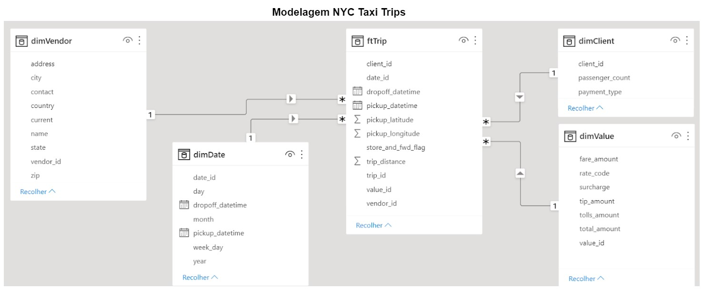

# MJK-Taxi - Análise de dados exploratória

Importar Bibliotecas Python para análise de dados
```python
import json 
import sqlite3 
import pandas as pd
import numpy as np
import seaborn as sns
import matplotlib as mat
import matplotlib.pyplot as plt
import colorsys
plt.style.use('seaborn-talk')
import warnings
warnings.filterwarnings("ignore")
%matplotlib inline
import datetime
```
Ler o arquivo json em um DataFrame
```python
df = pd.read_json('atento0.json', orient='records', nrows=4000000, lines=True)
df 
```

## Questão 1. Distância média
#### A distância média percorrida por viagens com no máximo 2 passageiros é: 
#### 2.835128496886849 ou 2.8 (miles ou km)
```python
df.loc[df['passenger_count'] == 2, 'trip_distance'].mean()
```

## Questão 2. Os 3 maiores vendors
#### Os 3 maiores vendors em quantidade total de dinheiro arrecadado são: 
#### 1o CMT (19549084.28)
#### 2o VTS (19043434.00)
#### 3o DDS (2714901.72)
```python
# Verificar quantos vendors diferentes existem 
print(df.groupby('vendor_id').size())

# Utilizar o método groupby() em múltiplas colunas, o count faz a contagem de linhas, ou seja, só do vendor (tipo texto/string), 
# já o sum faria a contagem do número decimal, ou seja, só do 'total_amount'
print(df.groupby('vendor_id')['total_amount'].count())

# Questão 2. RESULTADO
# Os 3 maiores vendors (CMT/ DDS/ VTS/ TS) em quantidade total de dinheiro arrecadado (total_amount) são:
print(df.groupby('vendor_id')['total_amount'].sum())
```

## Questão 3. Histograma
#### Histograma da distribuicao mensal, nos 4 anos, de corridas pagas em dinheiro
```python
df = pd.read_json('atento0.json', orient='records', nrows=4000000, lines=True)
df 

# Verificar quantos tipos de pagamentos diferentes existem 
print(df.groupby('payment_type').size())

# Padronizar os tipos de pagamento em letras Minúsculas e verificar novamente os tipo de pagamento
print(df.groupby(df['payment_type'].str.lower()).size())

# Criar coluna de Dia, Mês e Ano
df['day'] = df.dropoff_datetime.str.slice(8,10)
df['month'] = df.dropoff_datetime.str.slice(5,7)
df['year'] = df.dropoff_datetime.str.slice(0,4)
df

# Criar coluna limpa de Tipo de pagamento
df['pagamento'] = df['payment_type'].str.lower()
df

# Criar coluna Data e Datafull
df['data'] = df['month'].str.cat(df['year'],sep=".")
df['datafull'] = df['day'].str.cat(df['data'],sep=".")
df

# Mudar tipo da coluna Data e Datafull
df["datafull"] = df["datafull"].astype('datetime64[ns]')
df["data"] = df["data"].astype('float')
df

# Criar Dataframe selecionado por linhas com tipo de pagamento ‘cash’
df.set_index("pagamento",
            inplace = True)
# Selecionar linhas com tipo de pagamento ‘cash’
df = df.loc[["cash"]]
df

# Criar um DataFrame object de uma lista
df3 = pd.DataFrame(df,
                columns =['data'])
df3

# Questão 3. RESULTADO 
sns.distplot(df3['data'],kde=False,bins=100)
plt.xlabel("Mês")
plt.ylabel("Quantidade de passageiros")
plt.title("Distribuição de corridas pagas em dinheiro")
plt.show()
```


## Questão 4. Gráfico de série temporal 
#### Gráfico de série temporal contando a quantidade de gorjetas de cada dia, nos últimos 3 meses de 2012
```python
df = pd.read_json('atento0.json', orient='records', nrows=4000000, lines=True)
df 

# Criar coluna de Dia, Mês e Ano
df['day'] = df.dropoff_datetime.str.slice(8,10)
df['month'] = df.dropoff_datetime.str.slice(5,7)
df['year'] = df.dropoff_datetime.str.slice(0,4)
df

# Criar coluna Data e Datafull
df['data'] = df['month'].str.cat(df['year'],sep=".")
df['datafull'] = df['day'].str.cat(df['data'],sep=".")
df

# Mudar tipo da coluna Data e Datafull
df["datafull"] = df["datafull"].astype('datetime64[ns]')
df["data"] = df["data"].astype('float')
df

# Criando um DataFrame object de uma lista
dfq4 = pd.DataFrame(df,
                columns =['tip_amount', 'datafull'])
dfq4

# Selecionando linhas dos últimos 3 meses de 2012
df4 = dfq4.loc[dfq4["datafull"].between("2012-10-01", "2012-12-31")]
df4

# Questão 4. RESULTADO
df4.plot(x='datafull', y='tip_amount')
plt.xlabel("Data")
plt.ylabel("Quantidade de gorjetas")
plt.title("Gorjetas dos últimos 3 meses de 2012")
plt.show()
```


## Questão 5. Modelo lógico
#### Modelo lógico de dados construído para um Data Warehouse para o departamento de Recursos Humanos para uma empresa do segmento de Contact Center. 


